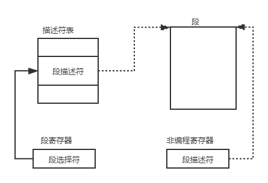

​		在去年就打算维护一个个人博客用于记录自己遇到的坑跟一些学习心得了，一方面是将一些容易遗忘的信息碎片沉淀到网络的海洋之中，另一方面也是想通过这里监督自己学习吧。没想到一直鸽了到现在。说实话，虽然主要是因为懒癌迟迟未付诸行动，但是我也常常困惑，又有什么东西是我所能沉淀于这茫茫大海的呢？鲸在海中死亡后最终沉到到海底成为大海的养分，而在网络中，众多个人博客站点所承载到信息碎片也给这片大海中所需要的人带来了养分吧，虽然现在我的知识体系还很贫弱，但也希望积累起来，能够为所需要的人带来帮助。

​		这系列的文章主要是在读*《深入了解Linux内核》*这本书时做的一些笔记，每看完一部分会尝试整理到这里，不可避免会有一些谬误跟理解不到位的地方，如果你有什么看法或建议，欢迎给我留言。

## 内存地址

首先需要了解3个基本概念：

- **逻辑地址**

- **线性地址**

- **物理地址**

  他们之间的关系可以简要由下图描述，这个过程由***MMU***完成：
  
  
  
  

该流程在此不多加赘述

### 逻辑地址

一个逻辑地址由两部分组成： **段标识符**（16位，又称**段选择符**） + **段内偏移**（32位）

为了快速找到段选择符，处理器提供段寄存器（cs,ss,ds,es,fs和gs）用于存放段选择符

3个专用寄存器：

| 寄存器 | 功能 |
| ---- | ---- |
|  ss   |  栈段寄存器 |
|  cs   |  代码段寄存器 |
|  ds   |  数据段寄存器 |

*\*cs寄存器中还有一个两位的字段用于标识CPU当前特权级（内核态、用户态）*

### 段描述符

每个段由一个**段描述符**（8字节）表示，它描述了段的特征，存放于**GDT**或**LDT**中

*（\*GDT在主存中大小和地址存放于gdtr控制寄存器 LDT地址及大小则存放于ldtr控制寄存器）*

*段描述符各字段含义：*

| 字段名 | 描述                                                 |
| ------ | ---------------------------------------------------- |
| Base   | 包含段的首字节的线性地址                             |
| G      | 粒度标志，置0为以字节为单位，否则以4k为单位          |
| Limit  | 段中最后一个内存单元偏移，决定段的长度               |
| S      | 系统标志：置0表示为一个系统段                        |
| Type   | 段的类型特征及存取权限                               |
| DPL    | 描述符特权级。表示访问该段要求的CPU最小特权级        |
| P      | Segment-Present：置0时表示该段不在主存，Linux中常为1 |
| D或B   | D或B的标志，取决于是代码段还是数据段                 |
| AVL    | 被Linux忽略                                          |

#### 快速访问段描述符

为了加速逻辑地址到线性地址的转换，80x86处理器提供一种非编程的寄存器供6个可编程段寄存器使用。每个非编程寄存器含**8字节**段描述符。每当一个段选择符被装入段寄存器，相应段描述法就由内存装入到对应的非编程寄存器。相当于做了一层缓存，减少了对GDT或LDT的访问。当段寄存器内容改变时，才有必要再次访问GDT或LDT。

*段选择符字段*

| 字段名 | 描述                                                         |
| ------ | ------------------------------------------------------------ |
| index  | 指定放在GDT或LDT中相应段描述符的入口                         |
| TI     | TI=0:段描述符在GDT中，TI=1:段描述符在LDT中                   |
| RPL    | 请求者特权级：相应段选择符装入cs时指示出当前cpu特权级，也可以用于访问数据段时削弱处理器特权级 |

*段描述符在GDT或LDT中相对位置由段选择符高13位乘8得出（一个段描述符8字节长）*

*\*GDT第一项总为0（用于确保无效化空段选择符逻辑地址，以引起一个处理器异常）。GDT中段描述符最大数目为8191，即 *

#### 分段单元

=============================博主摸鱼去啦，缓慢施工中===================================